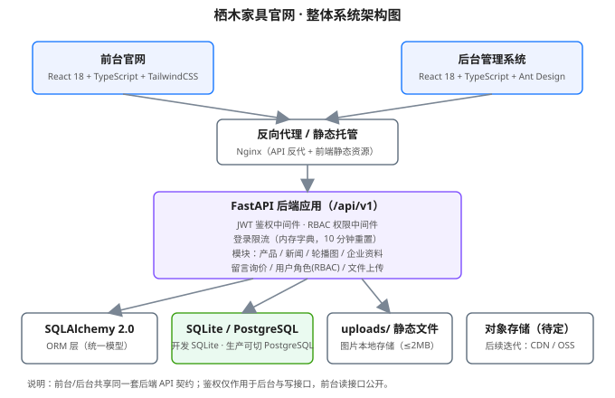
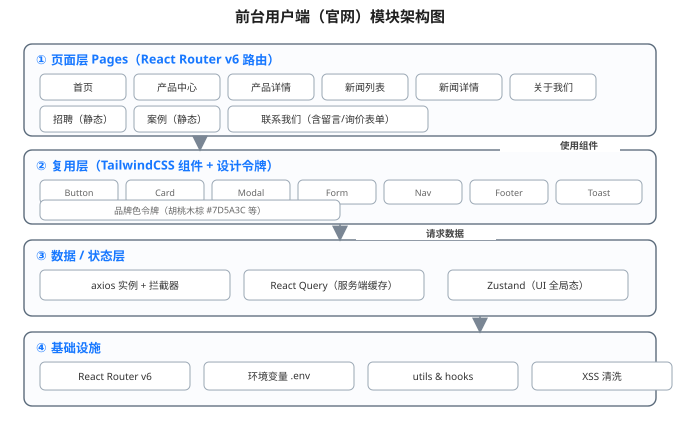
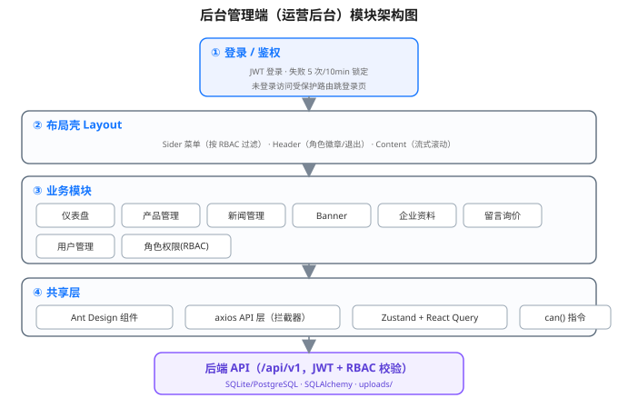
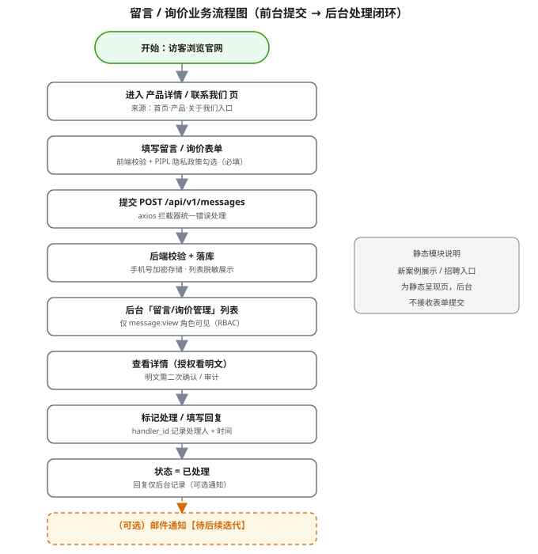
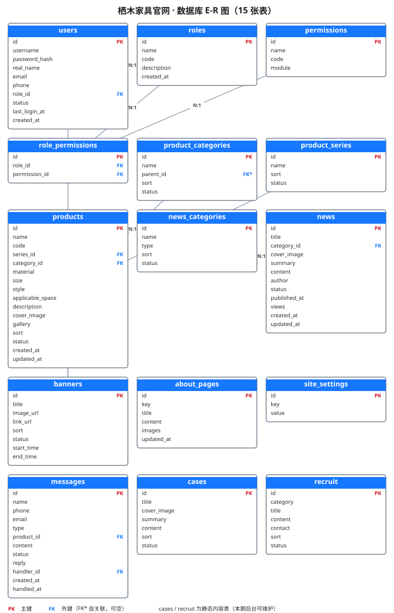

# 栖木家具官网 · 开发技术文档

> 版本：v1.0
> 编写日期：2026-09-08
> 文档状态：技术设计基线（供前后端按此开发与联调）
> 关联文档：`docs/PRD_企业家居网站.md`（v1.2）、`docs/UIUX_企业家居网站.md`（v1.1）
> 品牌说明：本文档全文、版权信息、备案信息统一使用品牌名「**栖木家具**」。

| 修订记录 | 日期 | 修订人 | 说明 |
|---|---|---|---|
| v1.0 | 2026-09-08 | 技术 | 基于 PRD v1.2 + UI/UX v1.1 沉淀技术设计基线，含架构图/E-R 图（SVG）、完整 API 契约、数据字典 |
| v1.1 | 2026-09-08 | 技术 | 优化修订：明确删除语义（软删/物理删）、登录失败 HTTP 状态码、手机号 AES-256-GCM 加密方案与密钥变量、初始超管生成机制、super_admin 放行；补充 JWT 库选型、完整错误码枚举、文件删除/批量接口、site_settings 备案号字段、公开读限流说明、开发 CORS、测试约定（§9.5）、搜索索引建议 |

---

## 0. 文档说明与范围边界

本文档是栖木家具官网（**前台展示官网 + 后台内容管理系统**）的**技术设计单一可信来源**，描述系统架构、目录结构、数据库设计、API 契约与前后端开发规范。本文档**只描述规范、结构与设计决策，不输出业务实现代码**。

本期交付范围严格对齐 PRD 第 0/11 章：
- 前台：5 主导航 + 二级栏目、首页六区、产品中心、新闻、案例/招聘（本期由**后端静态配置表 + 后台 CRUD**承载，见决策②）、关于我们、留言/询价表单、响应式与动效。
- 后台：登录与鉴权、仪表盘、内容管理（产品/新闻/Banner/企业资料/案例/招聘）、互动管理（留言/询价）、系统管理（用户/角色 RBAC）。
- 鉴权：JWT（access token，7 天有效期，无 refresh，见决策⑤）；SQLite 开发库，PostgreSQL 生产可切换（见决策③）。

### 本期关键决策（来自方案确认）
1. **品牌命名**：全文统一使用「栖木家具」。
2. **静态模块载体**：新案例 / 招聘改为「后端静态配置表（`cases` / `recruit`）+ 后台 CRUD」，不再用前端常量，避免内容变更需重新打包。
3. **PostgreSQL**：本期仅文档建议 + 配置 Alembic 支持切换；`settings.py` 经 `DATABASE_URL` 切换，开发用 SQLite，生产可切 PostgreSQL。
4. **登录限流**：本期用内存字典（key=用户名/IP，计数 + 时间戳，10 分钟自动重置），不引入 Redis；文档备注生产建议升级 Redis。
5. **JWT 刷新**：本期不实现 refresh token，access token 过期即重新登录，有效期 7 天。
6. **邮件/短信**：本期仅预留接口不实现，文档标注「待后续迭代」。
7. **阅读量**：`news.views` 为预留字段，接口返回该字段、默认值 0，前台不展示。

---

## 第1章 项目概述

### 1.1 项目背景与技术目标

客户为家居（家具）品牌「栖木家具」，需建设对外展示的企业官网（前台）与对内运营的内容管理后台（后台），参考标杆站点为蓝鸟家居官网（仅结构与视觉参考，非最终品牌）。

**技术目标**：
- 对外：专业、可信赖的响应式官网，承载品牌介绍、产品/案例曝光、新闻资讯、联系转化（留言/询价）。
- 对内：基于角色权限（RBAC）的内容运营平台，支持多角色协同维护官网内容。
- 可量化基线（对齐 PRD 1.2.1 / 8 / 9）：前台首屏 < 2s；列表接口 < 500ms；产品可检索 SKU ≥ 50；月有效线索 ≥ 50 条；移动端适配 100%。

### 1.2 技术栈总览（附选型理由）

| 层 | 技术 | 选型理由（一句话） |
|---|---|---|
| 前端框架 | React 18 + TypeScript | 生态成熟、类型安全，兼顾前台展示与后台中台的组件化开发效率 |
| 前台 UI | Tailwind CSS | 原子化样式契合品牌官网高度定制的视觉设计（暖木调设计令牌） |
| 后台 UI | Ant Design | 开箱即用的中后台组件，缩短 RBAC 管理界面的开发周期 |
| 后端框架 | FastAPI（Python 3.10+） | 原生异步 + 自动 OpenAPI 文档 + Pydantic 校验，契合 RESTful 契约开发 |
| 数据库 | SQLite（开发）/ PostgreSQL（生产） | SQLite 零部署适合开发验证；PostgreSQL 满足生产并发与可靠性，经 `DATABASE_URL` 平滑切换 |
| ORM | SQLAlchemy 2.0 | 2.0 类型注解式模型与异步会话，统一建模并支持多数据库后端 |
| 状态管理 | Zustand / React Query | Zustand 轻量管理 UI 全局态；React Query 负责服务端缓存与请求去重，避免自研 |
| 鉴权 | JWT（python-jose / PyJWT） | 无状态 token 契合前后端分离，后台接口级鉴权简单可靠 |
| 包管理 | 前端 pnpm / 后端 poetry（或 pipenv） | pnpm 磁盘占用小、依赖隔离；poetry 锁定后端依赖版本，环境可复现 |
| 密码哈希 | bcrypt（passlib） | 自适应成本因子，抵御彩虹表与暴力破解 |
| 富文本清洗 | bleach（或服务端白名单清洗） | 对新闻/企业资料富文本做 XSS 过滤，满足 PRD 8 安全要求 |

### 1.3 前后台分离架构说明

系统由三个独立部署单元构成，通过统一 API 契约（`/api/v1`）协作：

- **frontend（前台官网）**：纯展示型 React 应用，仅中文，响应式（PC + 移动端）。除明确标注"静态"的页面外，所有数据来自后端 API；无 C 端用户账户体系。
- **admin（后台管理系统）**：React + Ant Design 运营后台，基于 RBAC 的内容维护平台，桌面端为主、移动端折叠适配。
- **backend（后端 API）**：FastAPI 服务，承载全部业务逻辑、鉴权、RBAC、数据持久化。公开接口（读）无需鉴权；写接口与后台接口统一经 JWT + RBAC 校验。

前后台共享同一后端、同一套数据模型；前端通过 `axios` 实例 + 拦截器统一调用，后端经 API 版本化（`/api/v1`）保证契约稳定。

### 1.4 开发环境要求

| 项 | 要求 |
|---|---|
| Node.js | ≥ 18（前台/后台均依赖；推荐 20 LTS） |
| Python | ≥ 3.10（后端 FastAPI；推荐 3.11/3.12） |
| 包管理 | 前端 pnpm ≥ 8；后端 poetry ≥ 1.8（或 pipenv） |
| 数据库 | 开发 SQLite 3（随 Python 自带）；生产 PostgreSQL 14+ |
| 推荐 IDE | VS Code + 插件：ESLint、Prettier、Python、Pylance、Tailwind CSS IntelliSense、SQLite Viewer |
| 版本控制 | Git（main/dev/feature 分支策略，见第 9 章） |

---

## 第2章 项目目录结构

### 2.1 前端前台 `frontend/`

```
frontend/
├─ index.html                 # HTML 入口
├─ package.json               # 依赖与脚本（pnpm）
├─ vite.config.ts             # Vite 构建配置
├─ tsconfig.json              # TS 配置
├─ tailwind.config.ts         # Tailwind 配置（品牌设计令牌注入）
├─ postcss.config.js
├─ .env                       # 环境变量（VITE_API_BASE 等）
├─ .env.example
└─ src/
   ├─ main.tsx                # 应用入口（挂载 Router + QueryClient）
   ├─ App.tsx                 # 根组件 + 路由出口
   ├─ router/
   │  ├─ index.tsx            # React Router v6 路由表
   │  └─ routes.ts            # 路由常量定义
   ├─ pages/                  # 页面级组件（首页/产品/新闻/关于/招聘/案例）
   │  ├─ Home/  Products/  ProductDetail/  News/  NewsDetail/
   │  ├─ About/  Recruit/  Cases/  Contact/
   ├─ components/             # 复用 UI 组件（Button/Card/Modal/Form/Nav/Footer/Toast）
   ├─ hooks/                  # 自定义 Hooks（useProductList 等）
   ├─ api/                    # axios 实例 + 各模块请求函数 + 拦截器
   │  ├─ client.ts            # axios 实例、请求/响应拦截、401 跳登录
   │  ├─ products.ts  news.ts  messages.ts  about.ts  cases.ts  recruit.ts  banners.ts
   ├─ store/                  # Zustand 全局 UI 态（如筛选条件、导航态）
   ├─ types/                  # 与后端共享的 TS 类型定义
   ├─ constants/              # 静态常量（分类映射、PIPL 文案）
   ├─ styles/                 # 全局样式 + 设计令牌引用
   └─ utils/                  # 工具函数（格式化、校验、XSS 清洗前端侧）
```

### 2.2 前端后台 `admin/`

```
admin/
├─ index.html
├─ package.json
├─ vite.config.ts
├─ tsconfig.json
├─ .env / .env.example
└─ src/
   ├─ main.tsx
   ├─ App.tsx                 # 布局壳 + 路由出口
   ├─ router/index.tsx        # 后台路由表（含受保护路由守卫）
   ├─ layouts/
   │  └─ AdminLayout.tsx      # Sider + Header + Content 壳
   ├─ pages/                  # 登录/仪表盘/产品/新闻/Banner/企业资料/留言/用户/角色
   │  ├─ Login/  Dashboard/  Product/  News/  Banner/
   │  ├─ About/  Message/  User/  Role/
   ├─ components/             # 后台复用组件（Table 封装/Form 封装/Upload/Tag）
   ├─ hooks/
   ├─ api/                    # axios 实例 + 拦截器（携带 token、401 清会话）
   │  ├─ client.ts  auth.ts  products.ts  news.ts  banner.ts
   │  └─ about.ts  message.ts  rbac.ts  upload.ts  cases.ts  recruit.ts
   ├─ store/                  # Zustand（用户态/权限态/菜单态）
   ├─ directives/
   │  └─ can.ts               # RBAC 权限指令 can(role, perm)，驱动菜单/按钮显隐
   ├─ types/
   ├─ constants/
   ├─ styles/
   └─ utils/
```

### 2.3 后端 `backend/`

```
backend/
├─ pyproject.toml            # poetry 依赖与脚本
├─ alembic.ini               # Alembic 迁移配置
├─ .env / .env.example
├─ uploads/                  # 本地图片存储目录（静态映射 /media）
└─ app/
   ├─ main.py                # FastAPI 入口，挂载路由、中间件、CORS、静态
   ├─ core/
   │  ├─ config.py           # settings.py：pydantic-settings 读环境变量（dev/prod）
   │  ├─ security.py         # JWT 签发/校验、bcrypt 哈希、限流内存字典
   │  ├─ deps.py             # 依赖注入：get_db、get_current_user、require_perm
   │  ├─ exceptions.py       # 统一异常基类与处理器
   │  └─ logging.py          # 日志配置
   ├─ db/
   │  ├─ base.py             # SQLAlchemy Base / engine / Session
   │  ├─ session.py          # 异步会话依赖
   │  └─ init_db.py          # 建表 + 初始数据（读取 INIT_ADMIN_USER/INIT_ADMIN_PASSWORD 创建初始超管，已存在则跳过；权限/角色种子）
   ├─ models/                # SQLAlchemy 2.0 模型（15 张表）
   │  ├─ user.py  role.py  permission.py  product.py  news.py
   │  ├─ content.py  message.py  static.py
   ├─ schemas/               # Pydantic 请求/响应模型（含校验）
   │  ├─ auth.py  product.py  news.py  banner.py  about.py
   │  └─ message.py  rbac.py  upload.py  cases.py  recruit.py
   ├─ repositories/          # 数据访问层（SQLAlchemy 查询封装）
   ├─ services/              # 业务逻辑层（鉴权/RBAC/产品/新闻/留言/上传等）
   ├─ routers/               # 路由层（按模块注册 APIRouter）
   │  ├─ auth.py  products.py  news.py  banner.py  about.py
   │  ├─ message.py  rbac.py  upload.py  cases.py  recruit.py  system.py
   └─ migrations/            # Alembic 迁移脚本（versions/）
```

**分层依赖方向**：`routers → services → repositories → models`，依赖经 `core/deps.py` 注入，层间不反向依赖。

---

## 第3章 系统架构图

### 3.1 整体系统架构图

下图展示三端分离与前后端交互关系：前台/后台共享同一后端 API 契约；鉴权仅作用于后台与写接口，前台读接口公开。



**说明**：
- 反向代理（Nginx）负责 API 反代与前端静态资源托管；开发期可用 Vite 代理或 FastAPI 直接托管。
- FastAPI 应用内含 JWT 鉴权、RBAC 权限、登录限流（内存）三类中间件/逻辑。
- 数据层经 SQLAlchemy 统一建模，开发用 SQLite，生产可经 `DATABASE_URL` 切 PostgreSQL；图片落 `uploads/`，后续可平滑切对象存储。

### 3.2 前台用户端模块架构图



**说明**：前台采用"页面层 → 复用层 → 数据/状态层 → 基础设施"四层结构。页面经 React Router v6 组织；复用层承载 Tailwind 品牌组件；数据层用 axios 拦截器统一请求、React Query 缓存服务端数据、Zustand 管理 UI 全局态；基础设施含路由、环境变量、工具与富文本 XSS 清洗。

### 3.3 后台管理端模块架构图



**说明**：后台以登录/鉴权为入口，经 Layout 壳（Sider 菜单按 RBAC 过滤）承载 8 个业务模块；共享层复用 Ant Design 组件、axios API 层、Zustand + React Query 状态，以及 `can()` 权限指令；所有写操作经后端 API（JWT + RBAC 校验）。

### 3.4 留言/询价业务流程图



**说明**：流程为"前台表单提交 → 后端校验落库（手机号加密、列表脱敏） → 后台客服/运营按 RBAC 查看并处理 → 标记已处理/回复"的闭环。新案例/招聘为静态呈现页，不进入该提交流程。

---

## 第4章 数据库设计

### 4.1 E-R 图

下图覆盖全部 15 张表及外键关系（PK 主键、FK 外键、FK* 自关联可空）。



### 4.2 数据字典

> 类型以 SQLAlchemy 2.0 表示为准；`INTEGER` 布尔字段以 0/1 存储；时间统一 UTC 存储并注明；图片以 URL 字符串存储。

#### 4.2.1 账户与权限

**users（用户）**

| 字段 | 类型 | 长度 | 可空 | 默认 | 说明 |
|---|---|---|---|---|---|
| id | Integer | - | 否 | 自增 | 主键 |
| username | String | 50 | 否 | - | 登录名，唯一 |
| password_hash | String | 128 | 否 | - | bcrypt 哈希 |
| real_name | String | 50 | 是 | - | 姓名 |
| email | String | 120 | 是 | - | 邮箱 |
| phone | String | 20 | 是 | - | 电话（**AES-256-GCM 加密存储**，密钥来自 `PHONE_ENCRYPT_KEY`；列表查询脱敏为 138****8888，仅授权角色可见） |
| role_id | Integer | - | 否 | - | 外键 → roles.id |
| status | Integer | - | 否 | 1 | 1 启用 / 0 停用 |
| last_login_at | DateTime | - | 是 | - | 最近登录 |
| created_at | DateTime | - | 否 | now() | 创建时间 |

**roles（角色）**

| 字段 | 类型 | 长度 | 可空 | 默认 | 说明 |
|---|---|---|---|---|---|
| id | Integer | - | 否 | 自增 | 主键 |
| name | String | 50 | 否 | - | 角色名 |
| code | String | 50 | 否 | - | 角色编码（super_admin 等），唯一 |
| description | String | 200 | 是 | - | 描述 |
| created_at | DateTime | - | 否 | now() | 创建时间 |

**permissions（权限）**

| 字段 | 类型 | 长度 | 可空 | 默认 | 说明 |
|---|---|---|---|---|---|
| id | Integer | - | 否 | 自增 | 主键 |
| name | String | 50 | 是 | - | 权限名 |
| code | String | 50 | 否 | - | 权限编码（product:edit 等），唯一 |
| module | String | 50 | 是 | - | 所属模块 |

**role_permissions（角色-权限）**

| 字段 | 类型 | 长度 | 可空 | 默认 | 说明 |
|---|---|---|---|---|---|
| id | Integer | - | 否 | 自增 | 主键 |
| role_id | Integer | - | 否 | - | 外键 → roles.id |
| permission_id | Integer | - | 否 | - | 外键 → permissions.id |

> 唯一约束：`(role_id, permission_id)`。

#### 4.2.2 产品

**product_categories（产品分类/适用空间）**

| 字段 | 类型 | 长度 | 可空 | 默认 | 说明 |
|---|---|---|---|---|---|
| id | Integer | - | 否 | 自增 | 主键 |
| name | String | 50 | 否 | - | 如 卧室/客厅 |
| parent_id | Integer | - | 是 | - | 自关联 → product_categories.id（本期可空） |
| sort | Integer | - | 否 | 0 | 排序 |
| status | Integer | - | 否 | 1 | 1 启用 / 0 停用 |

**product_series（产品系列）**

| 字段 | 类型 | 长度 | 可空 | 默认 | 说明 |
|---|---|---|---|---|---|
| id | Integer | - | 否 | 自增 | 主键 |
| name | String | 50 | 否 | - | 系列名（胡桃禮等） |
| sort | Integer | - | 否 | 0 | 排序 |
| status | Integer | - | 否 | 1 | 状态 |

**products（产品）**

| 字段 | 类型 | 长度 | 可空 | 默认 | 说明 |
|---|---|---|---|---|---|
| id | Integer | - | 否 | 自增 | 主键 |
| name | String | 120 | 否 | - | 名称 |
| code | String | 50 | 是 | - | 编号 |
| series_id | Integer | - | 是 | - | 外键 → product_series.id |
| category_id | Integer | - | 是 | - | 外键 → product_categories.id（适用空间） |
| material | String | 50 | 是 | - | 材质 |
| size | String | 100 | 是 | - | 尺寸 |
| style | String | 50 | 是 | - | 风格 |
| applicable_space | String | 50 | 是 | - | 冗余字段，由 category_id 派生，仅展示/检索 |
| description | Text | - | 是 | - | 图文详情（富文本/HTML） |
| cover_image | String | 255 | 是 | - | 封面 URL |
| gallery | Text | - | 是 | - | 多图 URL（JSON 数组） |
| sort | Integer | - | 否 | 0 | 排序 |
| status | Integer | - | 否 | 1 | 1 上线 / 0 下线 |
| created_at | DateTime | - | 否 | now() | 创建 |
| updated_at | DateTime | - | 否 | now() | 更新 |

> **数据一致性**：`applicable_space` 由 `category_id` 派生，仅作展示/检索冗余；所有写操作以 `category_id` 为准，禁止单独维护造成不一致。

#### 4.2.3 新闻

**news_categories（新闻分类）**

| 字段 | 类型 | 长度 | 可空 | 默认 | 说明 |
|---|---|---|---|---|---|
| id | Integer | - | 否 | 自增 | 主键 |
| name | String | 50 | 否 | - | 企业新闻/行业资讯 |
| type | String | 20 | 是 | - | 类型编码 |
| sort | Integer | - | 否 | 0 | 排序 |
| status | Integer | - | 否 | 1 | 状态 |

**news（新闻）**

| 字段 | 类型 | 长度 | 可空 | 默认 | 说明 |
|---|---|---|---|---|---|
| id | Integer | - | 否 | 自增 | 主键 |
| title | String | 200 | 否 | - | 标题 |
| category_id | Integer | - | 是 | - | 外键 → news_categories.id |
| cover_image | String | 255 | 是 | - | 封面 |
| summary | String | 300 | 是 | - | 摘要 |
| content | Text | - | 是 | - | 正文（富文本） |
| author | String | 50 | 是 | - | 作者 |
| status | Integer | - | 否 | 0 | 1 发布 / 0 草稿 |
| published_at | DateTime | - | 是 | - | 发布时间 |
| views | Integer | - | 否 | 0 | 阅读量（预留，决策⑦：默认 0，接口返回、前台不展示） |
| created_at | DateTime | - | 否 | now() | 创建 |
| updated_at | DateTime | - | 否 | now() | 更新 |

#### 4.2.4 轮播图与资料

**banners（轮播图）**

| 字段 | 类型 | 长度 | 可空 | 默认 | 说明 |
|---|---|---|---|---|---|
| id | Integer | - | 否 | 自增 | 主键 |
| title | String | 120 | 是 | - | 标题 |
| image_url | String | 255 | 否 | - | 图片 |
| link_url | String | 255 | 是 | - | 跳转链接（限 http(s)://） |
| sort | Integer | - | 否 | 0 | 排序 |
| status | Integer | - | 否 | 1 | 状态 |
| start_time | DateTime | - | 是 | - | 展示开始（可选） |
| end_time | DateTime | - | 是 | - | 展示结束（可选） |

**about_pages（企业资料/关于我们）**

| 字段 | 类型 | 长度 | 可空 | 默认 | 说明 |
|---|---|---|---|---|---|
| id | Integer | - | 否 | 自增 | 主键 |
| key | String | 50 | 否 | - | 唯一键：history/brand/contact/about（关于栖木家具） |
| title | String | 120 | 是 | - | 标题 |
| content | Text | - | 是 | - | 内容（富文本；contact 用结构化 JSON） |
| images | Text | - | 是 | - | 配图 JSON（可选） |
| updated_at | DateTime | - | 否 | now() | 更新 |

**site_settings（站点配置）**

| 字段 | 类型 | 长度 | 可空 | 默认 | 说明 |
|---|---|---|---|---|---|
| id | Integer | - | 否 | 自增 | 主键 |
| key | String | 50 | 否 | - | 唯一键：company_name/phone/email/address/social 等 |
| value | Text | - | 是 | - | 值（JSON 可存复杂结构） |

#### 4.2.5 互动

**messages（留言/询价）**

| 字段 | 类型 | 长度 | 可空 | 默认 | 说明 |
|---|---|---|---|---|---|
| id | Integer | - | 否 | 自增 | 主键 |
| name | String | 50 | 否 | - | 姓名 |
| phone | String | 20 | 否 | - | 电话（加密存储、列表脱敏） |
| email | String | 120 | 是 | - | 邮箱（选填） |
| type | String | 20 | 否 | - | message 留言 / inquiry 询价 |
| product_id | Integer | - | 是 | - | 外键 → products.id（选填） |
| content | Text | - | 否 | - | 内容 |
| status | Integer | - | 否 | 0 | 0 未处理 / 1 已处理 |
| reply | Text | - | 是 | - | 回复 |
| handler_id | Integer | - | 是 | - | 外键 → users.id（处理人） |
| created_at | DateTime | - | 否 | now() | 提交时间 |
| handled_at | DateTime | - | 是 | - | 处理时间 |

#### 4.2.6 静态内容（决策②新增，后台可维护）

**cases（新案例展示）**

| 字段 | 类型 | 长度 | 可空 | 默认 | 说明 |
|---|---|---|---|---|---|
| id | Integer | - | 否 | 自增 | 主键 |
| title | String | 120 | 否 | - | 标题 |
| cover_image | String | 255 | 是 | - | 封面 |
| summary | String | 300 | 是 | - | 简介 |
| content | Text | - | 是 | - | 图文详情 |
| sort | Integer | - | 否 | 0 | 排序 |
| status | Integer | - | 否 | 1 | 状态 |

**recruit（招聘入口）**

| 字段 | 类型 | 长度 | 可空 | 默认 | 说明 |
|---|---|---|---|---|---|
| id | Integer | - | 否 | 自增 | 主键 |
| category | String | 20 | 否 | - | social 社会招聘 / campus 校园招聘 |
| title | String | 120 | 否 | - | 标题 |
| content | Text | - | 是 | - | 正文（岗位方向/我们提供等） |
| contact | String | 200 | 是 | - | 联系方式 |
| sort | Integer | - | 否 | 0 | 排序 |
| status | Integer | - | 否 | 1 | 状态 |

### 4.3 表关联关系与级联策略

| 关系 | 外键 | 级联策略 | 说明 |
|---|---|---|---|
| users.role_id → roles.id | role_id | RESTRICT（删角色前须先解绑/停用用户） | 角色不可误删致用户悬空 |
| role_permissions.role_id → roles.id | role_id | CASCADE | 删角色同步清权限映射 |
| role_permissions.permission_id → permissions.id | permission_id | CASCADE | 删权限同步清映射 |
| products.series_id → product_series.id | series_id | RESTRICT（删系列前须先处理其产品） | 保护产品归属 |
| products.category_id → product_categories.id | category_id | RESTRICT（删分类前须先处理其产品） | 保护产品归属 |
| news.category_id → news_categories.id | category_id | RESTRICT | 保护新闻归属 |
| messages.product_id → products.id | product_id | SET NULL（产品删除保留留言） | 线索不丢失 |
| messages.handler_id → users.id | handler_id | SET NULL（处理人删除则置空） | 处理记录保留 |
| product_categories.parent_id → product_categories.id | parent_id | SET NULL（父级删除子级置顶） | 自关联，本期可空 |

> 软删除策略：全表以 `status` 字段标记上下线/启停，不做物理删除（除角色权限映射 CASCADE 外），保障可恢复与审计。

> **删除语义统一约定（重要）**：
> - **内容类资源**（产品 / 新闻 / Banner / 案例 / 招聘 / 用户 / 角色）的 `DELETE` 接口均为**软删除**（翻转 `status` 字段：1↔0），**不物理删除**，因此不会触发下表外键 RESTRICT 约束。
> - 仅当在后台对**分类 / 系列 / 新闻分类**执行**物理删除**时，下表 RESTRICT 才生效；删除前须先将其子资源（产品、新闻）迁移至其他分类/系列或先行软删。
> - 用户/角色删除一律为"停用"（status=0），超级管理员角色不可删、不可降权。

### 4.4 索引设计建议

| 表 | 索引字段 | 类型 | 理由 |
|---|---|---|---|
| users | username | 唯一索引 | 登录查询与唯一约束 |
| users | role_id | 普通索引 | 按角色筛选用户 |
| roles | code | 唯一索引 | 权限判定按 code 查找 |
| permissions | code | 唯一索引 | RBAC 判定高频 |
| product_categories | status | 普通索引 | 前台只取启用分类 |
| product_series | status | 普通索引 | 前台只取启用系列 |
| products | (series_id, category_id, status) | 复合索引 | 产品列表筛选/空间+系列组合高频 |
| products | sort | 普通索引 | 排序展示 |
| news | (category_id, status, published_at) | 复合索引 | 新闻列表按分类+发布时间倒序 |
| banners | (status, sort) | 复合索引 | 首页轮播取启用+排序 |
| messages | (status, type, created_at) | 复合索引 | 后台筛选+时间排序 |
| messages | product_id | 普通索引 | 关联产品查询 |
| about_pages | key | 唯一索引 | 按 key 取资料 |
| site_settings | key | 唯一索引 | 按 key 取配置 |
| cases / recruit | (status, category, sort) | 复合索引 | 静态内容列表筛选/排序 |

> PostgreSQL 生产环境可对 `messages.phone`（脱敏后）慎用索引；手机号属 PII，索引需评估合规（见 PRD 8.1）。
> **关键词搜索**：`products.name` / `news.title` 的 `LIKE` 模糊搜索在 SQLite 下不走 B-tree 索引（仅前缀匹配可用索引）；生产 PostgreSQL 建议对名称/标题建 `pg_trgm` GIN  trigram 索引以加速模糊检索。本期开发期 `LIKE` 即可，不做全文索引。

---

## 第5章 API 接口设计（重点章节）

### 5.1 接口设计规范

- **RESTful 风格**：资源用名词复数，写操作走 `/admin` 前缀区分受控资源；公开读接口置于 `/api/v1` 根。
- **URL 命名**：全小写中划线；版本前缀统一 `/api/v1`；受控写接口统一 `/api/v1/admin/...`。
- **HTTP 方法**：GET 查询、POST 新增、PUT 全量更新、DELETE 删除、PATCH 部分更新（本期以 PUT 为主）。
- **内容类型**：`application/json`（除文件上传 `multipart/form-data`）。

### 5.2 统一响应格式

**成功**：
```json
{
  "code": 0,
  "message": "ok",
  "data": { }
}
```

**失败**：
```json
{
  "code": 10001,
  "message": "用户名或密码错误",
  "data": null
}
```

**分页 `data` 结构**：
```json
{
  "code": 0,
  "message": "ok",
  "data": {
    "items": [ { }, { } ],
    "total": 42,
    "page": 1,
    "page_size": 20
  }
}
```

**HTTP 状态码规范**：200 成功；400 业务参数错误；401 未认证（缺失/过期 token）；403 无权限（RBAC 拒绝）；422 参数校验失败（Pydantic）；429 登录限流；5xx 服务端错误。

**业务码（10000+）全量枚举**（业务码与 HTTP 状态码双轨：HTTP 层管传输态 401/403/422/429/5xx，业务码管业务结果）：

| 业务码 | 含义 | 触发接口/场景 |
|---|---|---|
| 0 | 成功 | 全部成功响应 |
| 10001 | 用户名或密码错误（凭证错误） | POST /auth/login |
| 10002 | 账号锁定（连续失败超限） | POST /auth/login（限流期内） |
| 10003 | 资源不存在 | 任意按 id 查询/操作不存在的资源 |
| 10004 | 权限不足（业务级拒绝） | RBAC 依赖拒绝 |
| 10005 | 文件类型/大小不符 | POST /admin/upload |
| 10006 | 隐私同意未勾选 | POST /messages |
| 10007 | 账号已停用 | 登录/鉴权时 status=0 |
| 10008 | 手机号/邮箱格式校验失败 | 写接口参数校验（业务级补充） |

### 5.3 认证鉴权方式（JWT）

- **方案**：登录成功签发 JWT（access token），`Authorization: Bearer <token>` 携带；后端 `get_current_user` 依赖解析并注入当前用户。
- **有效期**：7 天（604800 秒，决策⑤）；**不实现 refresh token**，过期即重新登录。
- **密码**：bcrypt 哈希存储，登录比对哈希。
- **登录限流**：内存字典记录 `{key: (失败次数, 首次失败时间)}`，key = 用户名（兼顾 IP）；连续失败 **5 次 / 10 分钟**锁定，锁定态返回 429/10002，10 分钟自动重置（决策④）。**生产建议升级 Redis**（见第 11 章）。
- **登出**：本期为客户端清除 token，服务端无状态（决策⑤）；`/auth/logout` 仅作会话清理确认。
- **token 失效**：用户被停用（status=0）时，鉴权依赖额外校验 status，拒绝已签发但未过期 token。
- **公开读接口限流**：本期**不**对公开读接口（products/news/banners 等）施加限流；生产环境建议前置网关（Nginx/API 网关）或 Redis 全局限流防爬（见第 11 章）。登录限流按 §5.3 内存字典实现。

### 5.4 分页规范

- **请求**：`?page=1&page_size=20`（page 从 1 起；page_size 默认 20，上限 100）。
- **响应**：`data` 含 `items / total / page / page_size`（见 5.2）。
- **前台场景**：首页取最近 3 条、产品列表每页 6 条、后台列表每页 20 条（对齐 UI/UX 6 性能规范）。

### 5.5 详细接口列表

> 字段标注：`必` 必填 / `选` 选填；类型含 string/int/boolean/datetime。
>
> **删除语义**：本章所有 `DELETE` 接口默认遵循 §4.3 统一约定——内容类资源为**软删除**（翻转 `status`），不物理删、不触发外键 RESTRICT；仅分类/系列/新闻分类的物理删除受 RESTRICT 保护。

#### 5.5.1 认证模块

**POST /api/v1/auth/login** — 公开
请求参数：

| 字段 | 类型 | 必/选 | 说明 |
|---|---|---|---|
| username | string | 必 | 登录名 |
| password | string | 必 | 明文密码（传输走 HTTPS） |

请求示例：
```json
{ "username": "admin", "password": "Admin@123456" }
```
响应示例：
```json
{
  "code": 0,
  "message": "ok",
  "data": {
    "access_token": "eyJhbGciOiJIUzI1NiIs...",
    "token_type": "bearer",
    "expires_in": 604800,
    "user": {
      "id": 1, "username": "admin", "real_name": "超级管理员",
      "role": { "id": 1, "code": "super_admin", "name": "超级管理员" },
      "permissions": ["dashboard:view", "product:manage", "rbac:user:manage"]
    }
  }
}
```
错误码：10001 凭证错误；10002 账号锁定（429）；401 缺失凭证。

**POST /api/v1/auth/logout** — 需登录
请求：无。响应：`{ "code": 0, "message": "ok", "data": null }`

**GET /api/v1/auth/me** — 需登录
响应 `data`：当前用户对象（同 login 中 `user`）。

#### 5.5.2 产品模块

**GET /api/v1/products** — 公开
请求参数：

| 字段 | 类型 | 必/选 | 说明 |
|---|---|---|---|
| series_id | int | 选 | 按系列筛选 |
| category_id | int | 选 | 按适用空间筛选 |
| keyword | string | 选 | 关键词搜索（名称） |
| page / page_size | int | 选 | 分页（默认 1/20） |
| sort | string | 选 | 排序字段，默认后台 sort |

请求示例：`GET /api/v1/products?series_id=1&category_id=3&page=1&page_size=6`
响应示例：
```json
{
  "code": 0, "message": "ok",
  "data": {
    "items": [
      { "id": 12, "name": "胡桃禮餐桌", "code": "HL-001",
        "series_id": 1, "series_name": "胡桃禮",
        "category_id": 3, "category_name": "餐厅",
        "cover_image": "/media/products/12.jpg", "status": 1 }
    ],
    "total": 53, "page": 1, "page_size": 6
  }
}
```
**GET /api/v1/products/{id}** — 公开
响应 `data`：产品完整字段（name/code/series/category/material/size/style/applicable_space/description/cover_image/gallery），**不含价格字段**（PRD 4.2.1）。

**GET /api/v1/product-categories** — 公开；**GET /api/v1/product-series** — 公开
响应 `data`：`items` 为启用分类/系列列表（id/name/sort/status）。

**POST /api/v1/admin/products** — product:create
请求参数（摘要）：

| 字段 | 类型 | 必/选 | 说明 |
|---|---|---|---|
| name | string | 必 | 名称 |
| series_id | int | 必 | 系列 |
| category_id | int | 必 | 适用空间 |
| code / material / size / style | string | 选 | 规格 |
| description | string | 选 | 图文详情 |
| cover_image / gallery | string | 选 | 图片 URL |
| sort / status | int | 选 | 默认 0/1 |

请求示例：
```json
{ "name": "胡桃禮餐桌", "series_id": 1, "category_id": 3,
  "material": "北美黑胡桃", "size": "1600×900×750mm", "style": "新中式",
  "cover_image": "/media/products/12.jpg", "status": 1 }
```
响应：`{ "code": 0, "message": "ok", "data": { "id": 12, ...创建对象 } }`
错误码：422 校验失败；403 越权。

**PUT /api/v1/admin/products/{id}** — product:edit；**DELETE /api/v1/admin/products/{id}** — product:delete（**软删除**：置 status=0 下线，不物理删、不触发外键约束）
**POST /api/v1/admin/products/batch-status** — product:edit（body `{ids:[], status}`，批量上下线）
**POST /api/v1/admin/products/batch-sort** — product:edit（body `{orders:[{id, sort}]}`，批量排序）
**POST/PUT/DELETE /api/v1/admin/product-categories**、**/api/v1/admin/product-series** — product:manage（分类/系列 CRUD，参数含 name/sort/status/parent_id）

#### 5.5.3 新闻模块

**GET /api/v1/news** — 公开（参数 category_id/keyword/page/page_size，按 published_at 倒序，仅取 status=1）
**GET /api/v1/news/{id}** — 公开（返回 title/category/cover/summary/content/author/published_at/views）
> `views` 字段返回（默认 0），前台不展示（决策⑦）。

**POST /api/v1/admin/news** — news:create
请求示例：
```json
{ "title": "栖木家具斩获红点设计奖", "category_id": 1,
  "cover_image": "/media/news/8.jpg", "summary": "近日...",
  "content": "<p>正文富文本...</p>", "author": "品牌部", "status": 1 }
```
**PUT /api/v1/admin/news/{id}** — news:edit；**DELETE /api/v1/admin/news/{id}** — news:delete

#### 5.5.4 轮播图模块

**GET /api/v1/banners** — 公开（取 status=1 且时间窗命中，按 sort 返回 items: title/image_url/link_url）
**POST/PUT/DELETE /api/v1/admin/banners** — banner:manage（参数 title/image_url/link_url/sort/status/start_time/end_time）

#### 5.5.5 企业资料 / 站点配置模块

**GET /api/v1/about/{key}** — 公开（key ∈ history/brand/contact/about；返回 title/content/images）
**GET /api/v1/site-settings** — 公开（返回站点配置 JSON：company_name/phone/email/address/social 等）
**PUT /api/v1/admin/about/{key}** — about:manage（更新对应资料富文本）
**PUT /api/v1/admin/site-settings** — about:manage（批量更新 value）

#### 5.5.6 留言 / 询价模块

**POST /api/v1/messages** — 公开
请求参数：

| 字段 | 类型 | 必/选 | 说明 |
|---|---|---|---|
| name | string | 必 | 姓名 |
| phone | string | 必 | 电话（pattern 校验） |
| email | string | 选 | 邮箱 |
| type | string | 必 | message 留言 / inquiry 询价 |
| product_id | int | 选 | 关联产品 |
| content | string | 必 | 内容 |
| privacy_agreed | boolean | 必 | 隐私同意（须 true，否则 10006） |

请求示例：
```json
{ "name": "张先生", "phone": "13800008888", "type": "inquiry",
  "product_id": 12, "content": "请问胡桃禮餐桌可否定制尺寸？", "privacy_agreed": true }
```
响应：`{ "code": 0, "message": "ok", "data": { "id": 1001 } }`
错误码：10006 未同意隐私；422 校验失败。

**GET /api/v1/admin/messages** — message:view
响应 `data.items`：列表，**phone 解密后脱敏为 138****8888** 展示（底层 AES-256-GCM 加密存储，密钥 `PHONE_ENCRYPT_KEY`），仅授权角色可见；导出/查看详情时方可还原明文（同样限授权角色）。
**PUT /api/v1/admin/messages/{id}** — message:handle（body: status(1)/reply/handler_id；标记处理+回复）

#### 5.5.7 用户与角色（RBAC）模块

**GET/POST/PUT/DELETE /api/v1/admin/users** — rbac:user:manage
- POST 新增用户：`{username, password, real_name, email, phone, role_id, status}`
- PUT 编辑/停用；支持密码重置（独立接口或 body 含 password 字段）
- DELETE 停用（超级管理员不可删）

**GET/POST/PUT/DELETE /api/v1/admin/roles** — rbac:role:manage
- 角色权限为**预设分配**（v1.2）：创建/编辑仅维护 name/description，权限按预设模板赋予，无逐权限勾选 UI。
- 超级管理员角色默认不可删/降权。

**GET /api/v1/admin/permissions** — rbac:role:manage（返回权限基线列表，供预设模板参考）
**POST /api/v1/admin/roles/{id}/permissions** — rbac:role:manage（body 接收预设**模板名**如 `super_admin`/`editor`/`viewer`，按模板授予整套权限；**非单权限逐条勾选**）

#### 5.5.8 文件上传模块

**POST /api/v1/admin/upload** — 需登录（按资源归属再 RBAC 校验）
- 请求：`multipart/form-data`，字段 `file`
- 限制：格式 jpg/png/webp，单文件 ≤ 2MB，服务端重命名防覆盖
- 响应：`{ "code": 0, "message": "ok", "data": { "url": "/media/products/1712.jpg" } }`
- 错误码：10005 类型/大小不符
- **文件删除（已传资源清理）**：`DELETE /api/v1/admin/files?url=<file_url>` — 需登录 + `upload:manage`；校验 URL 落在 `UPLOAD_DIR` 内（防路径穿越）后删除物理文件；产品图被替换后调用此接口清理旧图。无独立文件表，按 URL 直接定位。

#### 5.5.9 静态内容模块（决策②新增）

**GET /api/v1/cases** — 公开（status=1 列表，含 cover/title/summary）；**GET /api/v1/cases/{id}** — 公开
**POST/PUT/DELETE /api/v1/admin/cases** — 后台可维护（权限映射见【待确认】5.9）
**GET /api/v1/recruit** — 公开（按 category 社会/校园返回）；**POST/PUT/DELETE /api/v1/admin/recruit** — 后台可维护

#### 5.5.10 系统模块

**GET /api/v1/health** — 公开（健康检查，见第 10 章）

### 5.6 接口权限矩阵

| 接口 | 公开 | 需登录 | 角色/权限 |
|---|---|---|---|
| /auth/login, /auth/logout, /auth/me | login 公开 | me/logout 需登录 | - |
| /products, /products/{id}, /product-categories, /product-series | ✓ | | - |
| /admin/products 及分类/系列 | | ✓ | product:create/edit/delete/manage |
| /news, /news/{id} | ✓ | | - |
| /admin/news | | ✓ | news:create/edit/delete |
| /banners | ✓ | | - |
| /admin/banners | | ✓ | banner:manage |
| /about/{key}, /site-settings | ✓ | | - |
| /admin/about/{key}, /admin/site-settings | | ✓ | about:manage |
| /messages（提交） | ✓ | | - |
| /admin/messages | | ✓ | message:view |
| /admin/messages/{id}（处理） | | ✓ | message:handle |
| /admin/users | | ✓ | rbac:user:manage |
| /admin/roles, /admin/permissions | | ✓ | rbac:role:manage |
| /admin/upload | | ✓ | 登录 + 资源归属 RBAC（建议 upload:manage） |
| /admin/files（删除已传文件） | | ✓ | upload:manage |
| /cases, /recruit（读） | ✓ | | - |
| /admin/cases, /admin/recruit | | ✓ | 【待确认】about:manage 或新增 case/recruit:manage |
| /health | ✓ | | - |

> 越权访问受保护接口返回 **403**（RBAC 依赖 `require_perm` 拦截）。
> **super_admin 放行**：`super_admin` 角色在 `require_perm` 中**短路放行全部权限**，不受权限码限制；该角色不可被删、不可被降权（见 §5.5.7）。

---

## 第6章 前端开发规范

### 6.1 组件规范
- 一律**函数组件 + Hooks**；文件命名 PascalCase（如 `ProductCard.tsx`），工具文件 camelCase。
- Props 用 `interface`/`type` 显式定义并导出（放 `types/` 或组件同目录 `.types.ts`）。
- 展示组件与容器组件分离：页面（`pages/`）负责数据获取与组合，复用组件（`components/`）纯展示。

### 6.2 状态管理方案
- **Zustand**：仅管理真正的 UI 全局态（前台筛选条件、后台菜单折叠态、当前用户/权限态）。
- **React Query**：负责所有服务端数据（列表/详情/提交），含缓存、重试、失效刷新；不将服务端数据放进 Zustand。
- 划分原则：服务端数据 → React Query；跨组件 UI 态 → Zustand；局部组件态 → `useState`/`useReducer`。

### 6.3 路由配置（React Router v6）
- 前台 `router/index.tsx` 定义路由表：扁平 `routes` + `Outlet` 嵌套布局；动态路由 `/products/:id`、`/news/:id`。
- 后台受保护路由用 `<ProtectedRoute>` 包裹，未登录跳 `/login`；`can(role, perm)` 控制菜单/按钮显隐。
- 路由懒加载（`React.lazy`）降低首屏体积。

### 6.4 API 调用封装
- `api/client.ts`：axios 实例，`baseURL = import.meta.env.VITE_API_BASE`；
  - 请求拦截：附加 `Authorization`；
  - 响应拦截：解包 `{code,message,data}`，`code !== 0` 抛统一错误；401 → 清 token 跳登录；403 → 无权限提示；422/5xx → Toast。
- 各模块请求函数（`products.ts` 等）返回 `data` 字段，供 React Query 调用。

### 6.5 环境变量配置
- `.env`：`VITE_API_BASE=http://localhost:8000/api/v1`；不提交密钥，提供 `.env.example`。
- 仅暴露 `VITE_` 前缀变量给前端构建。

### 6.6 代码规范
- ESLint + Prettier：Prettier 负责格式化（单引号、分号、2 空格）；ESLint 管 `react-hooks`/`@typescript-eslint`。
- 提交前 `lint-staged` + Husky 校验（建议）。

### 6.7 前后台代码复用策略
- 共享：TS 类型定义（`types/`）、axios 基础实例思路、工具函数（格式化/校验/XSS 清洗）。
- **不混用 UI**：前台 Tailwind 令牌与后台 Ant Design 令牌各成体系（对齐 UI/UX 1.4），组件层不复用。
- 可抽公共 `packages/shared` 或复制类型文件，保持单一事实来源。

---

## 第7章 后端开发规范

### 7.1 分层架构（Router → Service → Repository）
- **Router**：解析请求、调 Service、组装响应；不含业务逻辑。
- **Service**：业务逻辑（鉴权/RBAC/产品/新闻/留言/上传），事务边界所在。
- **Repository**：SQLAlchemy 查询封装，仅数据访问；不直接处理业务。
- 依赖经 `core/deps.py` 注入（`get_db` / `get_current_user` / `require_perm`）。

### 7.2 路由注册规范
- 按模块 `APIRouter(prefix="/api/v1/...")`，在 `main.py` 统一 `include_router`；
- 公开接口不加依赖；受控接口加 `dependencies=[Depends(get_current_user)]`；RBAC 接口加 `require_perm("xxx")`。

### 7.3 请求参数校验（Pydantic）
- 所有写请求定义 Pydantic 模型（`schemas/`），字段类型 + 约束（`max_length`、正则、枚举）；
- 富文本/URL 字段后端二次校验（XSS 白名单、链接协议白名单 http(s)://）。

### 7.4 全局异常处理
- `core/exceptions.py`：统一异常基类；注册 `ExceptionMiddleware` 捕获：
  - 业务异常 → `{code:业务码, message}`；
  - 校验失败（RequestValidationError）→ 422 结构化错误；
  - 未认证/无权限 → 401/403；
  - 未捕获 → 500 + 日志记录 `request_id`。

### 7.5 日志规范
- 级别：开发 DEBUG、生产 INFO；格式 `[%(asctime)s] %(levelname)s %(name)s %(message)s`；
- 输出：控制台（生产可接文件/集中日志）；敏感字段（密码、手机号明文）不落日志。

### 7.6 配置管理（settings.py）
- `core/config.py` 用 pydantic-settings 读 `.env`；
- 区分 dev/prod：`ENVIRONMENT`、`DATABASE_URL`（决策③：SQLite/PostgreSQL 切换）、`JWT_SECRET`、`JWT_EXPIRE_SECONDS=604800`、`CORS_ORIGINS`、`UPLOAD_DIR`、`MAX_UPLOAD_MB=2`、`ALLOWED_EXTENSIONS`、`PHONE_ENCRYPT_KEY`（32 字节 base64，PII 手机号 AES-256-GCM 密钥）、`INIT_ADMIN_USER`、`INIT_ADMIN_PASSWORD`（初始超管凭据，init_db 读取创建）。
- **Alembic**：配置 `alembic.ini`，迁移脚本放 `migrations/versions/`；本期确保可切 PostgreSQL（不强制落地迁移脚本，决策③）。

---

## 第8章 第三方集成

### 8.1 文件上传方案
- **存储**：本期本地 `backend/uploads/`，经静态映射 `/media` 对外提供；URL 持久化到表字段（cover_image/gallery/image_url）。
- **限制**：格式 jpg/png/webp，单文件 ≤ 2MB，服务端重命名（UUID + 原扩展名）防覆盖与路径穿越。
- **扩展**：`UPLOAD_DIR` 与 URL 前缀抽象，后续可平滑切对象存储（OSS/COS/S3 + CDN），见第 11 章。

### 8.2 邮件 / 短信服务（决策⑥）
- 本期**仅预留接口不实现**（如 `services/notify.py: send_reply_notice()`），文档标注「待后续迭代」；
- 后续可接 SMTP / 邮件服务 / 短信网关；回复通知为可选，不阻塞主流程。

### 8.3 其他第三方接入

- **PII 加密（手机号）**：留言/询价 `phone` 以 **AES-256-GCM** 加密存储，密钥来自环境变量 `PHONE_ENCRYPT_KEY`（32 字节，建议 KMS/密钥管理服务托管）；IV 随机生成并随密文存储。解密仅限后台授权角色在"查看/联系客户"时使用，列表一律脱敏为 `138****8888`。**禁止**用 Base64 等可逆编码冒充加密。
- **富文本 XSS 清洗**：服务端白名单（bleach）清洗新闻/企业资料 HTML，剥离 `script`、`on*` 与危险协议；前端展示共用同规则。
- **跳转链接白名单**：Banner `link_url` 仅允许 `http(s)://`，禁 `javascript:`/`data:`。
- **地图嵌入**：联系我们地图位用 iframe/组件嵌入，URL 经白名单校验。
- **SEO（可选）**：关键页 meta 标题/描述、语义化结构、sitemap（生产建议）。

---

## 第9章 开发流程与分工

### 9.1 前后端并行开发策略
1. **定契约**：前后端确认本文档第 5 章 API（路径/参数/响应/错误码）+ 第 4 章数据模型，产出 OpenAPI。
2. **前端 Mock**：前端按契约用 Mock 数据（MSW / 本地 mock）并行开发页面，不阻塞。
3. **后端实现**：按分层完成 Service/Repository/Router + 校验 + 鉴权。
4. **联调**：以 OpenAPI 为基线逐接口联调，前后端对照 checklist。

### 9.2 建议开发顺序
- **Phase 1 项目初始化**：三端脚手架、依赖、配置、CI。
- **Phase 2 数据库建表**：模型 + Alembic + 种子（超管/权限/角色）。
- **Phase 3 核心 API**：鉴权/RBAC → 产品/新闻/Banner/企业资料/留言/上传 → 静态 cases/recruit。
- **Phase 4 前端页面**：前台（首页/产品/新闻/关于/招聘/案例/联系）→ 后台（登录/仪表盘/各模块）。
- **Phase 5 联调测试**：对照第 5.6 矩阵、PIPL 脱敏、限流、XSS。
- **Phase 6 部署上线**：Docker/传统部署、环境配置、健康检查、内容初始化。

### 9.3 接口联调 checklist
- [ ] 响应结构含 `code/message/data`；分页含 `items/total/page/page_size`
- [ ] 公开读接口无需 token；写/后台接口 401/403 正确
- [ ] 参数校验 422、业务码与 message 准确
- [ ] 富文本 XSS 清洗生效；Banner 链接协议白名单生效
- [ ] 留言 phone 加密存储、列表脱敏（138****8888）
- [ ] 登录失败 5 次/10 分钟锁定（429）
- [ ] 静态 cases/recruit 后台 CRUD 即时反映前台

### 9.4 Git 分支管理策略
- `main`：生产可发布；`dev`：集成分支；`feature/xxx`：需求分支（PR 合入 dev）；
- 后台/前台/后端可同仓多包或分仓，统一 PR 评审 + CI（lint + test）。
- **合入 main**：`dev` 经 PR 评审合并；发布时从 `dev` 合入 `main` 并打 `vX.Y.Z` tag；生产部署基于 `main` 或 tag，禁止直接向 `main` 推送。

### 9.5 测试约定（建议纳入 CI）
- **后端**：`pytest` + `httpx`/`asyncio`；覆盖鉴权（登录/限流/越权）、产品/新闻 CRUD（软删语义）、留言加密与脱敏、文件上传校验、统一响应信封。
- **前端**：组件/工具函数单测（`vitest`）；关键交互用 `Testing Library` 冒烟；Mock 层对齐 §5 契约。
- **契约测试**：前后端以 §5 响应结构为基线，CI 校验接口返回 `code/message/data` 与分页字段齐备。
- 覆盖率目标：核心 Service/Repository ≥ 70%（建议，本期非强制）。

---

## 第10章 部署与运维

### 10.1 开发环境启动命令
```bash
# 后端（backend/）
poetry install
poetry run uvicorn app.main:app --reload --port 8000

# 前台（frontend/）
pnpm install && pnpm dev      # http://localhost:5173

# 后台（admin/）
pnpm install && pnpm dev      # http://localhost:5174
```

### 10.2 生产环境部署方案建议
- **Docker（推荐）**：后端 `python:3.11-slim` 镜像跑 gunicorn+uvicorn；前端 `pnpm build` 静态产物经 Nginx 托管；`docker-compose` 编排 API + Nginx（+ 可选 PostgreSQL）。
- **传统部署**：gunicorn/uvicorn 后台进程 + Nginx 反代 + 前端静态目录；SQLite 文件备份或切 PostgreSQL。
- 本期无强容器化要求（PRD 8），按团队运维能力选择。

### 10.3 环境变量清单
| 变量 | 说明 | 示例 |
|---|---|---|
| ENVIRONMENT | dev/prod | prod |
| DATABASE_URL | 数据库连接（决策③切换） | sqlite:///./app.db 或 postgresql+asyncpg://u:p@host/db |
| JWT_SECRET | JWT 签名密钥 | 强随机串 |
| JWT_EXPIRE_SECONDS | token 有效期 | 604800 |
| CORS_ORIGINS | 允许跨域来源 | 生产 `https://www.qimu.cn`；开发 `http://localhost:5173,http://localhost:5174` |
| UPLOAD_DIR | 上传目录 | ./uploads |
| MAX_UPLOAD_MB | 单文件上限 | 2 |
| ALLOWED_EXTENSIONS | 图片格式 | jpg,png,webp |
| REDIS_URL | 限流/缓存（生产，可选） | redis://host:6379（本期未用） |
| PHONE_ENCRYPT_KEY | 手机号加密密钥 | 32 字节 base64（AES-256-GCM） |
| INIT_ADMIN_USER | 初始超管用户名 | admin |
| INIT_ADMIN_PASSWORD | 初始超管密码（强随机，首次部署后务必修改） | 强随机串 |

### 10.4 健康检查接口设计
**GET /api/v1/health** — 公开
```json
{ "code": 0, "message": "ok",
  "data": { "status": "healthy", "db": "ok", "timestamp": "2026-09-08T15:00:00Z" } }
```
- 探活：仅返回 status；深度：连 DB 执行 `SELECT 1` 校验依赖。
- 部署探针：K8s/Docker `healthcheck` 调用此接口。

---

## 第11章 开放问题与待决策事项

| # | 待决策项 | 当前建议 | 影响范围 |
|---|---|---|---|
| 1 | **cases/recruit 后台权限归属** | 暂映射到 `about:manage`（内容编辑可维护）；如需独立管控则新增 `case:manage`/`recruit:manage` 权限码并纳入预设模板 | RBAC 预设模板、权限矩阵 5.6、后台菜单 |
| 2 | **图片 CDN / 对象存储选型** | 本期本地 `uploads/`；生产选 OSS/COS/S3 + CDN，抽象 `UPLOAD_DIR`/URL 前缀平滑切换 | 上传服务、部署 |
| 3 | **部署平台** | Docker Compose / 传统 Nginx；按运维能力定 | 第 10 章 |
| 4 | **PostgreSQL 迁移脚本** | 本期仅 Alembic 配置就绪，不强制落地；流量超预期再迁移 | 数据库、运维 |
| 5 | **Redis 引入** | 本期不引入（限流用内存）；生产建议升级 Redis 支撑多实例与限流共享 | 鉴权、限流、可扩展性 |
| 6 | **邮件/短信通知** | 仅预留接口，待后续迭代实现 | 留言回复通知 |
| 7 | **阅读量统计** | `news.views` 预留默认 0，接口返回、前台不展示；后续迭代再补统计 | 新闻模块 |
| 8 | **多实例与会话** | 本期单实例无状态 JWT 可行；多实例需 Redis 共享限流/潜在黑名单 | 架构扩展性 |
| 9 | **静态模块后续是否升级为完整后台** | 案例/招聘本期已建表+CRUD；后续可加简历投递、职位发布 | 招聘/案例模块 |
| 10 | **图表与数据模型同步维护** | E-R/架构 SVG 由 diagram-builder 生成；后续改表须同步更新 `docs/diagrams/`，建议将生成脚本纳入仓库避免图与表漂移 | 文档维护 |

> 标注【待确认】的条目（权限归属 5.9、5.6 矩阵）待产品/技术确认后回填，不影响本期开发基线推进。

---

> 文档结束。本文档与 `PRD_企业家居网站.md`（v1.2）、`UIUX_企业家居网站.md`（v1.1）共同构成栖木家具官网交付基线；开发实现须与本文档及源文档保持一致，差异需回溯修订。
